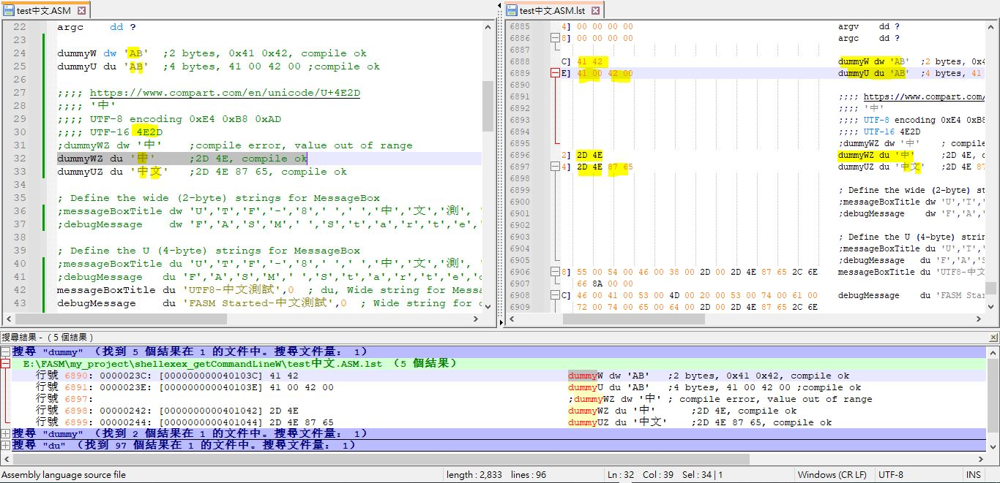
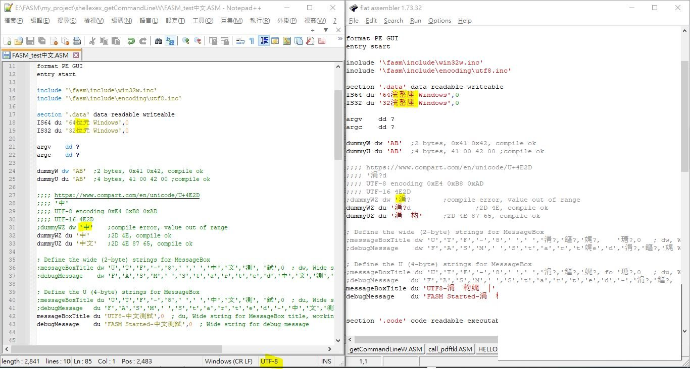

# FASM IDE 無法直接輸入中文

用其他文字編輯器修改 ASM, 必須存檔成 UTF-8  
輸入中文字, 必須用 du, 每個字符占用 2 bytes 
dw 實際是 word, 16bit, 

  
FASM IDE 打開時中文字會顯示不正常, 但是編譯後正常  
  
  
估計 FASM 編譯中文字時會依照 UTF-8 (3 bytes) 開始, 所以 dw 會報錯, 無法編譯  
但是用 du 的話, 最終編譯後的中文字是 UTF-16, 每個字符占用 2 bytes, 程序可編譯可執行  
成因不明白  
